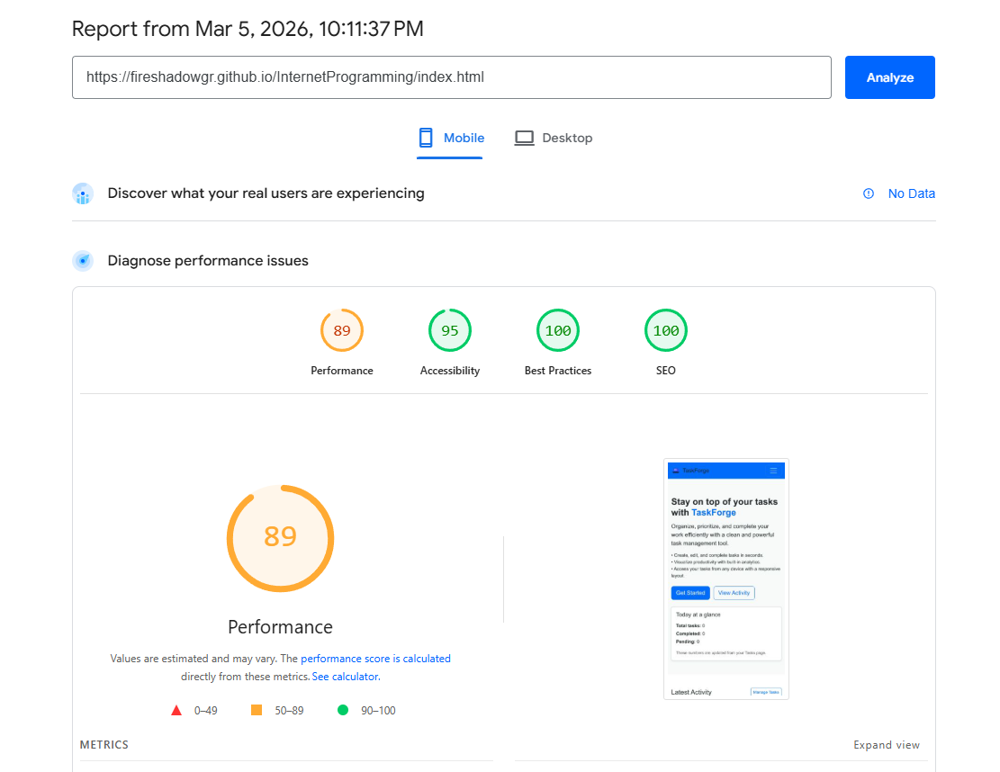
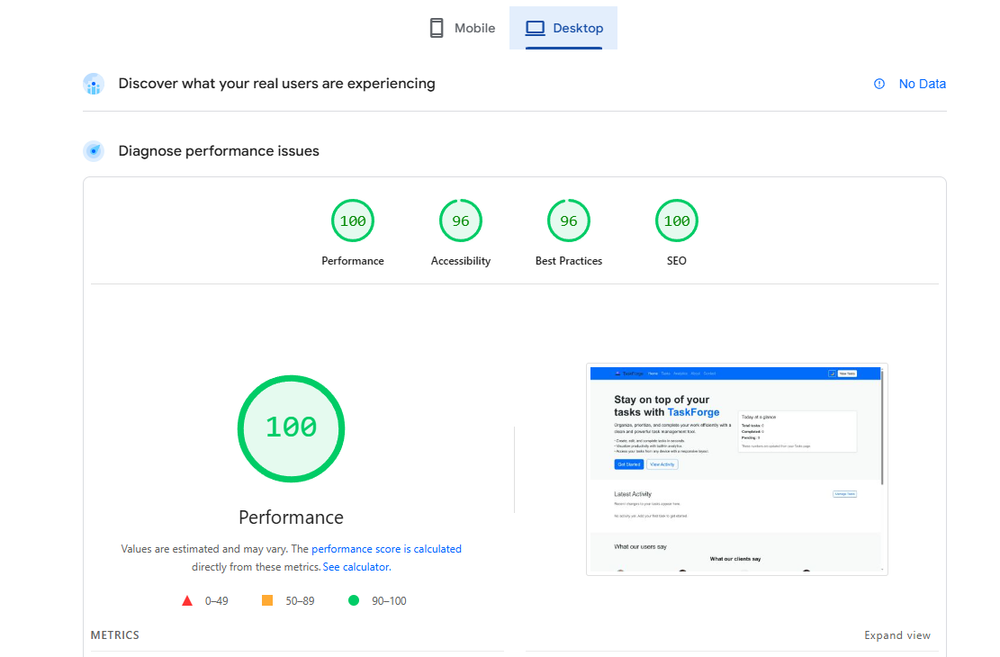

# TaskForge – Task Management Web Application

TaskForge is a responsive, client-side task management application built for the Internet Programming course assignment. It allows users to create, update, track, and analyze their tasks across multiple pages while demonstrating DOM manipulation, API integration, responsiveness, and basic accessibility best practices.

---

## 1. Description of the Task Allocation System

TaskForge is organized around a simple **task allocation model**:

- Each task contains:
  - Name (title)
  - Description
  - Due date
  - Priority (High, Medium, Low)
  - Status (Pending or Completed)
  - Unique ID

- Tasks are **stored in the browser** using `localStorage`, under keys:
  - `taskflow-tasks` (task list)
  - `taskflow-activity` (latest activity log)

- All pages that need task data read from these keys using shared helper functions in `main.js`, so the same data is available on:
  - `index.html` (Home – Today at a glance, Latest Activity, mini overview)
  - `tasks.html` (full CRUD and filters)
  - `analytics.html` (charts and stats)

- The task allocation logic is entirely client-side:
  - No backend; the app persists tasks in the user’s browser only.
  - This keeps the project focused on DOM manipulation, JavaScript logic, and responsive UI.

---

## 2. Coding Decisions

### 2.1 Tasks Page (`tasks.html` + `tasks.js`)

**Structure and layout**

- The page uses **Bootstrap 5** for layout, grid, and form styling.
- The main components:
  - Task form (add/edit)
  - Filters and sorting controls
  - Task table (list of tasks)
  - Summary badges (Total, Completed, Pending)

**Data model and storage**

- Tasks are represented as plain JavaScript objects:

  ```js
  {
    id: string,
    name: string,
    description: string,
    dueDate: string (YYYY-MM-DD),
    priority: 'high' | 'medium' | 'low',
    status: 'pending' | 'completed'
  }
  ```

- These objects are stored in an array, and the array is serialized to JSON in `localStorage` whenever the user adds/edits/deletes or toggles completion.
- `getStoredTasks()` and `saveTasks()` encapsulate reading/writing from `localStorage`, which keeps the rest of the code cleaner and easier to test.

**CRUD operations**

- The **task form** is used for both creating and editing tasks:
  - If the hidden `taskId` field is empty → create a new task (`status = 'pending'`).
  - If `taskId` has a value → find that task in the array and update it.
- The form uses native HTML5 validation with the `required` attribute and Bootstrap’s `.was-validated` pattern to show validation feedback.
- After successful submission:
  - The task array is updated.
  - The change is saved to `localStorage`.
  - An activity entry is added (see Latest Activity below).
  - The table is re-rendered.

- **Edit/Delete/Complete** actions are implemented using event delegation on the table’s `<tbody>`:
  - Buttons have `data-action` and `data-id` attributes.
  - A single click handler switches on `data-action`:
    - `"edit"`: populate form fields and show “Cancel edit”.
    - `"delete"`: confirm and remove from the array.
    - `"toggle-complete"`: flip `status` between `pending` and `completed`.

This approach avoids attaching separate listeners to every row and keeps the DOM manipulation minimal.

**Filtering and sorting**

- Filters:
  - Status filter (`all`, `pending`, `completed`).
  - Priority filter (`all`, `high`, `medium`, `low`).
- Sorting:
  - By due date (ascending/descending) or by task name (A–Z / Z–A).
- Implementation:
  - Whenever a filter or sort control changes, the `renderTasks()` function:
    - Copies the tasks array.
    - Applies filters.
    - Sorts the visible array.
    - Rebuilds the `<tbody>` content.

This design keeps the original data unchanged and makes the rendering logic easy to reason about.

**Summary section**

- Summary badges at the top of the page show:
  - Total tasks
  - Completed tasks
  - Pending tasks
- `updateSummary()` is called after any change to the tasks array to keep these numbers in sync with the table.

---

### 2.2 Latest Activity Section (Home, `index.html` + `main.js`)

**Purpose**

- Show the most recent actions performed on tasks so the user has a quick “activity feed”.

**Data model**

- Each activity entry has:

  ```js
  {
    type: string,         // e.g. 'Task created', 'Task updated', 'Task deleted'
    title: string,        // task name
    description: string,  // short description of the change
    timestamp: string     // ISO date string
  }
  ```

- Activities are stored in `localStorage` under `taskflow-activity`.

**How entries are created**

- In `task.js`, whenever a task is created, updated, deleted, or completed, the code calls:

  ```js
  addActivityEntry(activityType, taskName, description);
  ```

- `addActivityEntry()` appends the new entry to the activity array and saves it back to `localStorage`.

**Rendering on Home**

- On `index.html`, the “Latest Activity” section is rendered using a small block of logic in `main.js`:
  - Reads the last N entries (e.g. last 5) from `taskflow-activity`.
  - Reverses them so the newest is on top.
  - For each entry, creates a `<div>` inside `.list-group` with:
    - Title (task name)
    - Timestamp (formatted with `toLocaleString`)
    - Description and activity type
  - If there is no activity, shows a fallback message: “No activity yet. Add your first task to get started.”

This creates a clear separation: the tasks page **generates** activity; the home page **displays** it.

---

### 2.3 Personal Page (Analytics Page `analytics.html` + `analytics.js`)

For the “page of your choice”, this project uses **`analytics.html`** as a small task analytics dashboard.

**Components**

- Summary cards:
  - Total tasks
  - Completed tasks
  - Pending tasks
- Charts (using Chart.js):
  - Completed vs Pending (bar chart)
  - Tasks by Priority (pie chart)
- Upcoming tasks list:
  - Shows the next few pending tasks ordered by due date.

**Data source**

- All analytics read from the same `localStorage` tasks array using `getStoredTasks()`, so the numbers remain consistent with the Home and Tasks pages.

**Design decisions**

- Analytics is split into its own page to:
  - Keep `index.html` relatively light (only showing a small numeric overview).
  - Demonstrate multi-page navigation with shared state and a dedicated visualization area.
- Chart.js is included only where needed and configured to:
  - Use simple labels and colors.
  - Be fully responsive so charts resize with the viewport.

---

## 3. GitHub Repository

The project is hosted on GitHub at:

> https://github.com/FireShadowGR/InternetProgramming

(Replace this link if you change the repository name.)

The repository contains:

- All HTML pages (`index.html`, `tasks.html`, `analytics.html`, `about.html`, `contact.html`).
- CSS (`styles.css`).
- JavaScript (`main.js`, `tasks.js`, `analytics.js`, `contact.js`).
- Assets such as the TaskForge logo and any other images.

---

## 4. Lighthouse Results

I used **Chrome Lighthouse** (via PageSpeed Insights) on the deployed GitHub Pages URL:

> https://fireshadowgr.github.io/InternetProgramming/index.html

I captured results for both **mobile** and **desktop**.

### 4.1 Mobile report



- **Performance:** 89  
- **Accessibility:** 95  
- **Best Practices:** 100  
- **SEO:** 100  

**Reflection (mobile):**

- The performance score is slightly lower on mobile (89) due to:
  - The cost of loading external libraries (Bootstrap, Chart.js, Elfsight widget) on a simulated low‑end device.
  - Render time for the testimonials widget and charts.
- I accepted this trade‑off because:
  - The site still loads quickly and feels responsive.
  - The external libraries significantly simplify layout, styling, and analytics visualization.
- If I needed to push performance higher, I would:
  - Only load Chart.js and analytics scripts on `analytics.html`, not on `index.html`.
  - Consider deferring or conditionally loading the Elfsight testimonials widget below the fold.

### 4.2 Desktop report



- **Performance:** 100  
- **Accessibility:** 96  
- **Best Practices:** 96  
- **SEO:** 100  

**Reflection (desktop):**

- Desktop performance reached 100, meaning:
  - The CSS and JS bundles are small enough.
  - Rendering is fast on a typical desktop machine.
- Accessibility and Best Practices are slightly below 100 mainly due to minor recommendations such as:
  - Additional ARIA attributes or landmarks that Lighthouse suggests.
  - Minor contrast or tap‑target suggestions.
- I decided to address the most important issues:
  - Ensured proper `alt` text on images and labels on form inputs.
  - Implemented dark mode with sufficient contrast using CSS variables.
- A few advanced recommendations (like further reducing third‑party JS or adding more ARIA landmarks) were noted but left for future improvement, as they are not required for this assignment and would complicate the codebase.


## 5. Reflection on Development and Challenges

### 5.1 Designing a responsive layout

One challenge was ensuring the layout remained stable and readable on different screen sizes without “breaking” when the window was resized. I addressed this by:

- Using Bootstrap 5’s grid system (rows and columns) consistently for all major sections.
- Using `.card`, `.container`, `.row`, and `.col-*` components instead of fixed pixel widths.
- Testing the site on desktop and mobile viewports and adjusting padding/margins to keep content balanced.


### 5.3 Implementing dark mode correctly

Dark mode initially caused problems where text became unreadable or backgrounds did not change. To address this:

- I introduced custom CSS variables (e.g. `--page-bg`, `--card-bg`, `--text-color`) for both light and dark themes.
- The JavaScript toggle only flips a `data-theme` attribute on `<html>`, and all styling differences are handled in CSS.
- I added specific overrides for:
  - `.text-muted` in dark mode.
  - List-group items in the Latest Activity section.
  - Footer text colors in both themes.

But even so I couldn't manage to 100% make it work throught the entire website

### 5.4 Structuring JavaScript cleanly

The assignment required using jQuery or vanilla JS for DOM manipulation. I chose **vanilla JavaScript** and tried to:

- Keep each JS file focused:
  - `main.js` → shared features (dark mode, footer year, home counters, latest activity, quotes).
  - `tasks.js` → task CRUD, filters, and summary.
  - `analytics.js` → analytics calculations and charts.
  - `contact.js` → contact form validation and confirmation modal.
- Use immediately-invoked functions (`(function(){ ... })();`) and `DOMContentLoaded` listeners to avoid global pollution and to ensure elements exist before accessing them.